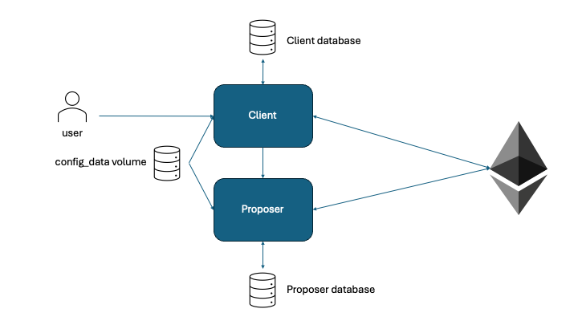

# Nightfall 4 Documentation

## Contents

- [Nightfall 4 Documentation](#nightfall-4-documentation)
  - [Contents](#contents)
  - [Overview](#overview)
  - [How it works](#how-it-works)
  - [Handling Fees in Transactions](#handling-fees-in-transactions)
  - [Handling chain reorganisations](#handling-chain-reorganisations)
  - [Local installation and testing](#local-installation-and-testing)
    - [Prerequisites for local installation](#prerequisites-for-local-installation)
    - [Download and test](#download-and-test)
  - [Configuration](#configuration)
  - [Deployment on a testnet for integration testing](#deployment-on-a-testnet-for-integration-testing)
    - [Preliminaries](#preliminaries)
    - [Configuration file](#configuration-file)
    - [Ethereum private keys](#ethereum-private-keys)
    - [Environment variables](#environment-variables)
    - [Initial deployment of contracts](#initial-deployment-of-contracts)
    - [Subsequent use of deployed contracts](#subsequent-use-of-deployed-contracts)
  - [Deployment on a testnet for beta testing](#deployment-on-a-testnet-for-beta-testing)
    - [Beta testing preliminaries](#beta-testing-preliminaries)
    - [Beta testing configuration](#beta-testing-configuration)
    - [Deploying contracts](#deploying-contracts)
    - [Deploying the Proposer and Client](#deploying-the-proposer-and-client)
  - [Architecture](#architecture)
    - [Comparison with Nightfall\_3](#comparison-with-nightfall_3)
    - [Nightfall\_4 containers](#nightfall_4-containers)
    - [Client Webhook](#client-webhook)
  - [APIs](#apis)
    - [Client APIs](#client-apis)
      - [X509 Certificates for Client](#x509-certificates-for-client)
      - [Value transactions](#value-transactions)
    - [Proposer APIs](#proposer-apis)
      - [X509 Certificates for Proposer](#x509-certificates-for-proposer)
  - [Test UI: Using the Menu Application](#test-ui-using-the-menu-application)
    - [1. Build the Menu Application](#1-build-the-menu-application)
    - [2. Prepare Environment Variables](#2-prepare-environment-variables)
    - [3. Start the Nightfall Containers (no-test profile)](#3-start-the-nightfall-containers-no-test-profile)
    - [4. Run the Menu Application](#4-run-the-menu-application)
  - [Production deployment](#production-deployment)
  - [Appendix](#appendix)


## Overview

Nightfall_4 (NF_4) is a Zero-Knowledge Proof (ZKP)-based application for transferring ERC20, ERC721, ERC1155 and ERC3525 tokens under privacy. It incorporates a Layer 2 ZK-ZK rollup so that transactions can be grouped into succinct blocks. This provides scalability, such that a private transfer typically takes around 6000 Gas.
Unlike [NF_3](https://github.com/EYBlockchain/Nightfall_3), NF_4's rollup is cryptographic in nature so that finality is achieved in the same time as the underlying blockchain.
NF_4 is written in Rust but the NF_3 API has been preserved as far as possible.

## How it works

In normal use, there will be at least one registered `proposer` connected to the blockchain. The purpose of the `proposer` is to make Layer 2 blocks. It makes an endpoint available to `clients`. Clients are the application that normal users will employ to make transactions that are hidden by ZKP.

It is not possible to deposit or withdraw funds to/from a Nightfall network without owning an X509 certificate that the Nightfall smart contracts accept as valid.

In normal operation a user will obtain a valid X509 certificate and provide it to the `client`, along with the corresponding private key. The client will then present this certificate, together with its Ethereum address, signed by the certificate's associated private key, to the X509 smart contract. This contract will validate the `client`'s credentials and, if valid, will add the client's Ethereum address to Nightfall allow list. From this point on, unless the address appears on a sanctions contract or the certificate expires, or is revoked by the issuer, the user can transact on Nightfall. Note that all of this implies that the `client` has access to the user's keys. This can be done via a Hardware Security Module (HSM) for storing the certicate and Ethereum keys but ZKP keys must be directly available to the `client` (it's not currently possible to run the ZKP computation inside an HSM).

Once validation is complete, the user can intitiate three types of transaction via the `client`:

1. Deposit: This will pass a payment from the user to the Nightfall smart contract (an escrow transaction). It will create a pending deposit which will later be picked up by the proposer and turned into deposit commitment(s) with an associated proof (this enables a deposit to be treated as a special case of a transfer transaction). User can deposit a fee in a deposit request which can be used to pay other transactions in the future, but it's not compulsory. If user deposit a so-called `deposit_fee`, then this deposit request will generate two commitments: one deposit commitment represents the `value` of the token the user intends to deposit, while the other is a `deposit_fee` commitment, which represents the fee the user deposits into Nightfall to pay the proposer for future transactions. If `deposit_fee == 0`, then there is only one value deposit commitment.

2. Transfer: This operation will select one or two existing commitments of suitable value (sum equal to or greater than the transfer value, with the tokenId matching the tokenId to be transferred). In addition to the transfer value, it will also account for the required fee. Two new output commitments will be created: one for the new owner receiving the transferred commitment, and the other for any change returned to the original owner of the input commitments. A separate fee commitment and fee change commitment will also be generated. All of these commitments will be validated by creating an UltraPlonk proof, ensuring that the operation is correct. The resulting commitments and proof are wrapped into a `ClientTransaction<P>` struct, which is then sent to one or more `proposer`s for inclusion in a Layer 2 block.

3. Withdraw: This is a special case of a Transfer but, rather than output commitments being created, suffienct funds are de-escrowed for the recipient to withdraw the amount they are being paid from the Nightfall contract.

*Note that all of these transactions expect a `X-Request-ID` header to be provided in UUID v4 format, and will fail with a bad request if this is not provided. The value of this header will be reported in log messages and returned with the response.*

The API for these requests is described in detail later on.

`proposer`s also require a certificate. Once validated, they have to register with the RoundRobin smart contract, via the ProposerManager interface. The `proposer`s take turns in a round-robin (other patterns are possible by replacing the contract that implements ProposerManager) to make Layer 2 blocks. The proposers receive transactions, either via their `transaction` endpoint directly from a `client` or, in the case of deposit transactions, from the Nightfall contract. Once a `proposer` has sufficient `client` transations to create a Layer 2 block (64 transactions, currently, but any power of 4 is acceptable) and it is the active `proposer` in the round-robin, it will compute a rollup-proof which, when validated on-chain simultaneously proves all of the client transaction proofs. When incorporating a deposit transaction, the proposer also computes the deposit proof. This is because the Layer 2 block containing the deposit needs to be known to compute the proof, preventing the `client` from computing it in advance.

The rollup poof is extremely compute-intensive (see next next section) and mathematically complex. There is a separate document in the /doc directory [Link when pushed] covering the details of how it works.

## Handling Fees in Transactions

`fee` in NF_4 compensates proposers for processing transactions and creating Layer 2 blocks. Notably, the fee itself can be zero. For transfer and withdrawal transactions, `fee` is deducted from the user’s available fee commitments to incentivize the proposer. For deposit transactions, clients directly pay `fee` to the Nightfall smart contract through `escrow_funds`, no fee commitments are created. Once all transactions and the rollup proof in a block are verified, the Nightfall contract transfers the total accumulated `fee`s to the proposer, ensuring fair compensation. Currently, the fee currency will always be the base token of the blockchain where the Nightfall.sol contract is deployed, and it is provided by adding the appropriate value to the `escrow_funds` during the transaction.

1. **Deposit Transactions:**
For a deposit transaction, the user deposits a token with a specific `value` into Layer 2, generating a `value` commitment. Additionally, the user can deposit a `deposit_fee` in advance to cover future `fee`s, which generates a separate `deposit_fee` commitment. As a result, the user must pay 2 * `fee` + `deposit_fee`: the first `fee` covers the creation of the `value` commitment, and the second `fee` covers the creation of the `deposit_fee` commitment. The `deposit_fee` serves as a reserve held in the Nightfall contract, from which future proposer fees can be deducted. If `deposit_fee == 0`, user only needs to pay `fee`.

2. **Transfer/Withdraw Transactions:**
If `fee` is not zero, for transfer and withdraw transactions, `fee` will be deducted from the user's available `fee` commitments. If the user does not have enough `fee` commitments to cover the required amount, the transaction will fail. It is important to note that the circuit allows the use of a maximum of two fee commitments to pay the fee. If the user has only one fee commitment available to cover the required amount, a zero-value commitment will be created, as the circuit operates with a fixed number of commitments (two for value and two for fee).

## Handling chain reorganisations

If the layer 1 chain experiences a reorganisation, then there is the possibility that the layer 2 state, as stored in the Clients' and Proposers' Merkle trees, will not be consistent with the Layer 1 state. This can be corrected by resynchronising from the Genesis block, but in most cases that is not a preferable option, given the time it takes. Instead, Nightfall brings its layer 2 state into agreement with the blockchain through replaying.

A chain reorganisation happens when two or more sets of nodes no longer agree on what the canonical chain looks like; there is a fork in the chain, with each set of nodes accepting a different chain segment as the truth. The consensus protocol will bring them back into agreement and one of the forks will become the new canonical chain, with the other chain segment being dropped.

In such a circumstance, most blockchain nodes (and certainly Geth) will replay any transactions that were on the dropped chain segment, but are not on the canonical segment. Thus, eventually, all transactions will appear on-chain and none will be lost. Note that this does not necessarily mean that all replayed transactions will succeed; some may fail because of a mutually exclusive transaction on the canonical chain (for example, if two transactions, one on each fork, spend the same token).

Nightfall makes use of the replay by applying two rules:

1. It guarantees that there is never more than one proposer creating Layer 2 blocks at any time, even in the event of a fork. It does this by waiting for the `rotate_proposer` call to finalise before the new proposer submits any blocks (note, the new proposer can compute blocks, just not submit them, so this doesn't reduce throughput).
2. The Client and Proposer will ignore layer 2 blocks that they've seen before.

This means that when a chain reorg occurs, the Clients and Proposers see a new sequence of `BlockProposed` events arrive, as the blockchain node replays the lost transactions. These transactions will be in the correct order (guaranteed by the transaction nonce), and so the Client or Proposer just waits until they get a Layer 2 block that they haven't seen before, and then processes it. They will soon catch up with the blockchain's current state.

This approach avoids the complexity of reverting the state of the Merkle trees in the event of a chain fork, and seems less complex than the other alternative of having Nightfall instances share layer 2 blocks directly using an 'instant finality' consensus mechanism.

## Local installation and testing

Note that the NF_4 prover requires substantial compute resource (144 cores and 750GB ram) and therefore cannot be run on a laptop. It is possible to run the entire NF_4 application suite on a Macbook Pro for development purposes but, in this case, the prover is replaced with a mock prover and the verifier does no checks of the proof; it simply returns 'true'. The mock prover is the default situation. See the `Configuration` section for information on how to configure a real prover. Care must be exercised when deploying the application to production so that it is not deployed with a mock prover active!

The following sections describe how to get NF_4 running on a Mac. It should also run on a Linux machine, but Windows is not supported.

### Prerequisites for local installation

The following applications are required:

- forge >=0.2.0
- anvil >=0.2.0
- docker
- openssl
- rust >=1.81.0 +nightly (nightly features are required for using certain unstable options (such as ignore in `rustfmt.toml`) when running `cargo +nightly fmt`. The normal `cargo fmt` on the stable toolchain will ignore these unstable features but will still format the rest of the code).
- git

forge and anvil can be installed as part of the [Foundry](https://github.com/foundry-rs/foundry) suite.

### Download and test

Clone the NF_4 repository:

```sh
git clone git@github.com:EYBlockchain/nightfall_4.git
```

Note: The docker build process installs the certificates stored in `configuration/trust` as trusted root certificates. If you do not wish to trust any of these, you should remove them from the directory before building or, alternatively, delete these lines in every dockerfile. That will install no extra certificates:

```sh
# install additional ca-certificates e.g. zscaler certificate (can be removed if not needed)
COPY ./configuration/trust/* /usr/local/share/ca-certificates/
RUN chmod 644 /usr/local/share/ca-certificates/* && update-ca-certificates
```

Build locally to make sure the nightfall_deployer are up to date:

```sh
cargo build
```

Then run unit tests:

```sh
cargo test
```

The Docker app should be running before you run `cargo test`, as some of unit test uses test_container.
This will take a few minutes and should complete with no test failures. If the unit tests pass then the integration tests can be run. The integrations tests run up NF_4 as a set of dockerised applications together with two test containers (`nightfall_test` and `nightfall_sync_test`) that call the nightfall http APIs and inspect the results:

First, generate some proving keys for the rollup prover (this only needs to be done once because they are saved locally and will be copied into the containers, and served from the configuration server)

```sh
cargo run --release --bin key_generation
```

```sh
docker compose --profile sync_test build
docker compose --profile sync_test down -v
docker compose --profile sync_test up
```

The build will take about 30 mins the first time around. Subsequent builds will be faster but are only required if you make a change to the code or the configuration files. In subsequent runs, the `docker compose --profile sync_test build` command can be omitted if there are no changes to the code or configuration files.

After running `docker compose --profile sync_test up` you should see the `nf4_deployer` container start up, deploy contracts to the Anvil blockchain simulator, then exit. At this point the `nf4_proposer` and `nf4_client` containers will run and the `nf4_test` container will start to call the Client API to run a series of basic tests, transferring tokens around. You may see some `http 404 not found` errors - this is perfectly ok and is part of the test. Any RED errors are not ok and indicate a problem unless they only originate from `ethers_providers::rpc::transports::ws` and indicate that a smart contract reverted. This is not necessarily what we would consider an error because we may have expected a reversion, however the logging of `ethers.rs` is not within our control.

Eventually the `nf4_test` container should exit with code 0. Any other code number indicates a problem.

The `nf4_sync_test` will run and check that a second proposer container can start and synchronise with the blockchain before exiting with code 0. Again, any other code indicates a problem.

At this point the integration test is complete and can be stopped with cntl-c.

## Configuration

Most of NF_4 is configured using a single file (`nightfall.toml`) in the project root. This file is read by all applications, even though not all values apply to all applications. Each main section can be selected as a configutation profile via the environment variable NF4_RUN_MODE, and other sections can be added to cover other use cases (e.g. a production config).

Do not confuse NF4_RUN_MODE, which selects the top-level section of `nightfall.toml` that will be used by the applications, and the docker compose `--profile`, which selects the containers that will be run (different profiles generally select different test containers, but they have wider applicability).

Additonally, any configuration item can also be overridden via an enviroment variable by naming an environment variable `NF4_<name of variable in nightfall.toml>`. You do not need to include the main section name: that is taken from the environment variable `NF4_RUN_MODE`. It defaults to `development` if `NF4_RUN_MODE` is not set. Some configuration variables are in sub-categories, for example under `[development.nightfall_deployer]`. Use a double __ to identify a variable within a sub-category (replacing the dot that would be used in the equivalent Rust struct). For example, the `log_level` variable in `nightfall.toml` that is under `[development]` under `[development.nightfall_deployer]` would be overridden by the environment variable `NF4_NIGHTFALL_DEPLOYER__LOG_LEVEL`, provided of course that `NF4_RUN_MODE` is set to `development` (or left unset).

Finally, secret items, such as keys, do not appear in `nightfall.toml` (except for one signing key used for basic testing - which will be removed soon). Depending on the wallet type being used, keys should instead be set via environment variables, a key-store or an HSM. Test keys are currently provided via a `.env` file in the project root, using the LocalWallet type, that sets its keys as environment variables.
NF_4 also supports the AzureWallet type, allowing keys to be securely stored in Azure Key Vault. To use this feature, you can register an NF_4 application in Azure App Registration and grant it access to the stored keys. When enabling this functionality, make sure to set the following environment variables:
AZURE_VAULT_URL=
DEPLOYER_SIGNING_KEY_NAME=
PROPOSER_SIGNING_KEY_NAME=
PROPOSER_2_SIGNING_KEY_NAME=
CLIENT_SIGNING_KEY_NAME=
CLIENT2_SIGNING_KEY_NAME=
AZURE_CLIENT_ID=
AZURE_CLIENT_SECRET=
AZURE_TENANT_ID= .

Not all of the configuration items can be static (i.e. known at compile-time). In particular, the addresses of the deployed contracts are not known in advance. The `deployer` saves addresses by writing directly to a shared file (`/app/configuration/toml/addresses.toml`) in the Docker volume (`address_data`). The Nightfall applications read addresses at startup, first attempting to load from the local file, then falling back to HTTP GET from the `configuration` service (nginx) with retry logic if the file is unavailable. The file must include a `chain_id` field for validation. Note that the `NF4_RUN_MODE` environment variable must be set for address validation to work correctly, with private IPs allowed in development mode to support Docker networking.

## Deployment on a testnet for integration testing

This section is useful if you just want to run an integration test with a 'real' testnet, rather than Anvil or similar. If you want to deploy for beta testing or similar, the next section is more useful.

This section probably also applies to a mainnet deployment, but that hasn't been tested yet. It's written and tested for a Base Sepolia testnet, but it will probably work for other testnets

When the nightfall contracts are on a testnet as opposed to a blockchain simulator such as anvil there are some other things to take account of:

1. The contracts and their state are persistent. This means that we need to distinguish between deploying the contracts, and just using already deployed contracts; when using anvil we always start with a deployment.
1. We have to pay for transactions. Thus Deployer (if deploying), Client and Proposer all need ether in their account.
1. The configuration of nightfall needs to be changed to work with the testnet client.

### Preliminaries

It's necessary to have sufficient testnet Ether to pay for all of the transactions that we are about to make. For Base Sepolia about [0.5] Eth is enough. For other testnets it may be more.

You must be able to access a blockchain client that can accept websocket connections (`ws://` or `wss://`). NF_4 subscribes to blockchain events and therefore an `http://` endpoint *will not work*. The Alchemy Base-Sepolia `wss://` endpoint has been tested and works well.

### Configuration file

Add a stanza to the `nightfall.toml` file for your testnet configuration, if it doesn't already exist. The `[base_sepolia]` section can be used as a guide. The testnet-dependent items are:

- `genesis_block`: If you are deploying contracts for the first time, set this to roughly the current layer 1 blocknumber for the testnet. This will make responses faster because nightfall will not look for events prior to this block when synchronising.
- `chain_id`: The chain id of the testnet. This is useful because deployments will be logged under a folder with the same name as the chain id. This allows one to distinguish from Anvil deploys, for example.
- `contracts.contract_addresses`: If you have already deployed the contracts then their addresses can be placed here so that nightfall knows where to find the contracts. Otherwise it will attempt to read the latest deployment log file, which is less reliable (e.g. you may not have deployed the contracts so your log file won't contain the correct information). If you don't want this to happen, leave the values blank (empty strings). These values will be ignored if you've told nightfall to deploy contracts via the `deploy_contracts` configuration item.
- `deploy_contracts`: If true, deployer will deploy new contracts, otherwise it will run and set up keys but won't deploy contracts before exiting. It's often convenient to override this value with an environment variable (see later) to save rebuilding the containers.

Other items may of course require configuring but they're not anything to do with which chain nightfall is deployed on. *You must rebuild the containers for these changes to take effect*.

```sh
docker compose --profile development build
```

Note that `--profile testnet` will also work but is essentially an alias.

### Ethereum private keys

Generate three Ethereum addresses and private keys. These should be stored in a file called `local.env` using the same layout as for `.env`. This will ensure that they are never inadvertently pushed to github. A convenient way to generate these keys is to use Metamask because then it's also easy to check their balance. Do not forget to supply all of these accounts with Ether.

### Environment variables

Set the environment variable `NF4_RUN_MODE=base_sepolia`. This will cause Nightfall to use the `[base_sepolia]` section of `nightfall.toml` rather than the `[development]` section.

If you need to, override the `deploy_contracts` configuration item, e.g.: `NF4_CONTRACTS__DEPLOY_CONTRACTS=false` (note the double underscore, which replaces the more common 'dot' notation).

Set `ethereum_client_url`: The url of the rpc endpoint of your layer 1 client. Alternatively, you can set this via `NF4_ETHEREUM_CLIENT_URL` in the `local.env` file.

### Initial deployment of contracts

Firstly, make sure you have told nightfall to deploy contracts. Either set `deploy_contracts` to `true` in `nightfall.toml` (and rebuild) or override it with `NF4_CONTRACTS__DEPLOY_CONTRACTS=true`

Once the above configuration changes have been made the process is the same as deploying to Anvil, with the new keys being selected:

```sh
docker compose --profile development --env-file local.env up
```

Note that the Anvil container will still be run up (we will probably change that at some point) but is not used. The above assumes that you have already generated proving and verifiying keys via:

```sh
cargo run --release --bin key_generation
```

If not, you will get a 'quotient' error.

### Subsequent use of deployed contracts

Ensure that `deploy_contracts` is `false`, using either of the two methods above, or nightfall will deploy and use a new set of contracts. It is advisable also to set the contract addresses in `nightfall.toml` (and rebuild). You can get the addresses from the `blockchain_assets/logs/deployer.s.sol/run-latest.json` file if you have deployed the contracts but, if you have deployed the contracts previously, their addresses will be read directly from this file if they are not set in `nightfall.toml`. Then running:

```sh
docker compose --profile development --env-file local.env up
```

will re-sync the containers to the existing smart contracts and run the integration tests, but will not deploy new contracts.

## Deployment on a testnet for beta testing

This section is useful if you want to deploy to a testnet for longer-term testing in a more 'production like' scenario where you will keep a proposer running and perhaps have serveral clients moving funds between themselves. These instructions may also work for mainnet deployment, but that hasn't been tested.

### Beta testing preliminaries

1. Make sure you have tokens in an ERC20|721|1155|3525 contract that your `client` can access. Your `client` will need some L1 funds to move into L2.
1. Have sufficient base currency funds in a separate account for each `client`, `proposer` and `deployer` to use. On Base Sepolia about 0.5 Eth per account is more than enough to get started.
1. Consider your deployment infrastructure:
1. All three applications (`proposer`, `client`, `deployer`) will need access to the blockchain through an RPC interface. In the case of the `client` and `proposer` this *must* support websockets.
1. The `client` must be able to reach the `proposer`'s `transaction` endpoint on `locahost:3001` to be able to send it client transactions
1. You will need to be able to `curl` the endpoints of the `client` and `proposer` to provide these applications with your user credentials.
1. The `client` holds in-memory ZKP keys and it must therefore run in a secure environment, which only allows access by bona-fide users. How you secure it is not within the scope of this document and the choices you make will need to be informed by the value of your transactions.
1. Note that, like most blockchain clients, Nightfall expects you to provide appropriate load balancing and security infrastructure. These things are not part of the application. As an example, you should terminate any `https://`, handle access tokens, and pass the payload to nightfall within your infrastructure; you should ensure any internet facing ports are appropriately firewalled.

The below assumes you use docker compose to orchestrate your containers, but anything else that works is fine and you probably shouldn't be using docker compose in anything approaching a production environment. The docker compose version will create database containers for the `client` and the `proposer`.

### Beta testing configuration

This is the same as for the previous section, so follow the advice in the 'Configuration', 'Ethereum private keys' and 'Environment variables' sections above. In this situation, however, you will only run the `deployer` when you want to deploy a new set of contracts so `deploy_contracts` for the deployer should always be `true`. Additionally, `mock_prover` should be `false` as there is no real purpose in running with a mock prover at this stage in the game.

If you are not using the provided MongoDB containers, you'll also need to point your containers to their databases via the appropriate `db_url` configuration.

### Deploying contracts

You should only need to do this once and will probably only redeploy if there is an update to the Smart Contracts themselves.

Build and run the stand-alone deployer.

```sh
docker compose --profile indie-deployer build
docker compose --profile indie-deployer --env-file local.env up
```

This should deploy all the Nightfall contracts. Their addresses will have been written to `configuration/toml/addresses.toml` and will also be in the deployment logs `blockchain_assets/logs`. Provide these addresses to the `client` and `proposer` via either the configuration server, their `addresses.toml` file or by adding them to their `nightfall.toml` file (in the latter case don't forget to set `deploy_contracts=false` or they'll be ignored). Use whichever method is most appropriate for your infrastructure.

As usual, a `Code 0` exit indicates a successful outcome.

### Deploying the Proposer and Client

Do not forget that the `proposer` will need to run on a large server (144 cores, 750GB RAM is a good size). Make sure `deploy_contracts` is set to false in nightfall.toml if you want the contract addresses to be read from nightfall.toml. Other than that, you need to create rollup proving and verifying keys by locally running:

```sh
cargo run --release --bin key_generation
```

Check that you are generating `REAL` rollup keys (the log output will tell you) and not mock ones. Then run the `proposer`

```sh
docker compose --profile indie-proposer build
docker compose --profile indie-proposer --env-file local.env up
```

The `client`s are deployed in a similar manner, however, it doesn't use the rollup proving key so you may want to set `mock_prover=true`. This will prevent it from computing a full rollup key, which will take a long time and probably fail on a laptop or small server. The client proving keys, which the `client`s use, are the same in either case.

At this point, you should be able to make nightfall transactions by curling the `client` API.

```sh
docker compose --profile indie-client build
docker compose --profile indie-client down -v
docker compose --profile indie-client --env-file local.env up
```

## Architecture

### Comparison with Nightfall_3

The application architecture of NF_4 is similar to NF_3 but is simplified in a number of aspects:

1. There are no separate `client` and `proposer` applications which, in NF_3, sign Ethereum transactions provided by either the `client` or `optimist` containers, instead the main `client` and `proposer` applications manage wallets for signing and also submit transactions to the blockchain. Various forms of wallet can be used, from a private key, stored as an environment variable, to a hardware wallet.
1. The `optimist` container is renamed to `proposer` in NF_4 but otherwise performs a similar role of creating Layer 2 blocks.
1. There is no `challenger` application; it's not required becasue NF_4 uses a cryptogrpahic (ZKP) rollup, not a cryptoeconomic (Optimistic) rollup.
1. The client proofs are UltraPlonk proofs, rather than Groth16, and therefore no per-circuit trusted setup is needed (the existing SRS from the Perpetual Powers of Tau ceremony is used for the overall setup).
1. Nightfall Native Tokens are not supported.

### Nightfall_4 containers

Nightfall runs with the following containers in production:

1. `deployer`: This is an ephemeral container which deploys the Nightfall contracts to the blockchain, and generates proving and verifying keys for use by the `client` container to make 'client proofs'. It writes to a `config_data` volume all of the static configuration data, the proving and verifying keys and the addresses of the Nightfall contracts that it has deployed. It then exits. This container may or may not be used in production, depending on the requirements of the production deployment.
1. `client`: This container is the main point of interaction for a user of the Nightfall service. It has an `http://` API, which is very similar to NF_3's and which enables deposit, transfer and withdraw client transactions. It communicates to the blockchain via a conventional blockchain node, which is external to the container, both listening for events and sending in transactions. It signs any ethereum transactions that it sends, using a wallet that it is given access to. Various types of wallet are supported. It generates proofs in support of client transactions and sends them directly to one or more `proposer` containers for incorporation into a Layer 2 block. There is no requirement that the `proposer` is trusted by the `client` but the `client` must be trusted by the user as it has access to their Ethereum and ZKP keys. Each user must run their own client. This is so that each client only has access to a single wallet. The client expects access to a MongoDB url for storage of commitments and metadata. It consumes configuration data from the `config_data` volume.
1. `proposer`: This container assembles Layer 2 blocks and computes a proof of correct assembly of the blocks, which shows that all the transactions incorporated in the block are correct (a 'rollup proof'). Thus, successful verification of the rollup proof on-chain by the Nightfall contract guarantees that all transactions in the block are correct. It exposes an `http://` API which `client`s can connect to send client transactions to the `proposer`.  Like the `client` container, it connects to the blockchain via an external node and has access to its own wallet to sign transactions which create Layer 2 blocks (`proposeBlock` transactions). It also requires access to a MongoDB to store Merkle tree data, a mempool and metadata. It consumes configuration data from the `config_data` volume. Note that computing a rollup proof is extremely computationally intensive and will take ~15 minutes on a 144 core machine with the compute running in parallel threads across all the cores. Users do not have to trust a `proposer` application and therefore can use `proposer`s provided by third parties. It makes sense for a user to submit a client transaction to multiple `proposer`s to prevent censorship; only one transaction will succeed.

No other containers are required, although for development use, the following other containers are provided and run up with `docker compose`:

1. `test`: a container used for integration testing. It sends transactions to a running `client` and monitors the results.
1. `sync_test`: another test container designed to demonstrate correct synchonisation of a newly created proposer.
1. `db_proposer`: A MongoDB instance used by the `proposer`. It has an associated volume called `mongodb_proposer_data`.
1. `db_client`: A MongoDB instance used by the `client`. It has an associated volume called `mongodb_client_data`.
1. `anvil`: a containerised version of Foundry's Anvil blockchain simulator, which is very similar to Ganache.



Figure 1: Diagram of NF_4 volumes and containers in production.

### Client Webhook

The `client` takes some seconds to compute a proof and, during that time, its compute resources will be fully utilised. It can therefore only process deposit/transfer or withdraw transaction one at a time (concurrency of one). This would cause problems for the http connection to the `client`, which could therefore only be synchronous and would block while the computation is happening. This would cause undesirable strong coupling to the calling application. To avoid this situation, the `client` receives such transactions concurrently and places them into a queue, returning a `202 Accepted` response. Once the proof is computed and the client transaction is sent to a `proposer`, a webhook returns further information about the transaction (see API documentation for details) in a TransactionEvent JSON object.

The Webhook also returns a BlockchainEvent object, when a L2 block is on-chain. This is useful for knowing when a transaction is on-chain. The two objects can be deserialised thusly:

```rust
    BlockchainEvent {
        l1_txn_hash: String,
        l2_block_number: I256,
        commitments: Vec<String>,
    }
    TransactionEvent {
        response: String,
        uuid: String,
    }
```

The uuid is the X-Request-ID for the original deposit/transfer/withdraw transaction. This enables the webhook response to be correlated with the original request.
The webhook URL can be set in the `Nightfall.toml` configuration file.

Below, we give a minimal, testing-only webhook you can run on your host. In this example: containers reach webhook at `http://host.docker.internal:8080/webhook`.

1) Minimal Python (Flask)
```
# Create and run a tiny Flask server on your host
python3 -m venv .venv
source .venv/bin/activate
pip install Flask
cat > webhook.py <<'EOF'
from flask import Flask, request
from datetime import datetime
app = Flask(__name__)
@app.route("/webhook", methods=["POST"])
def webhook():
    data = request.get_json(silent=True)
    # Heuristics to classify payload
    kind = "TransactionEvent" if isinstance(data, dict) and "uuid" in data else \
           "BlockchainEvent"  if isinstance(data, dict) and "l1_txn_hash" in data else \
           "Unknown"
    print(f"[{datetime.utcnow().isoformat()}Z] {kind}: {data}")
    return "", 200
if __name__ == "__main__":
    # Bind to 0.0.0.0 so Docker containers can reach it
    app.run(host="0.0.0.0", port=8080)
EOF
python3 webhook.py
```

2) Point Nightfall to the host webhook
Set the URL via Nightfall.toml and env:

`WEBHOOK_URL=http://host.docker.internal:8080/webhook`

Then ensure your services consume it. For example, client already has:

- NF4_NIGHTFALL_CLIENT__WEBHOOK_URL=${WEBHOOK_URL}

(If other services also publish, give them the same env var.)

Nightfall.toml:

`webhook_url = "http://host.docker.internal:8080/webhook"`

## APIs

These API urls are examples. Some values such as erc addresses are implementation-specific, so the values given won't work everywhere but they show the general form of an API call. The values below arise from using the deployer container with Anvil and a wallet mneumonic of `test test test test test test test test test test test junk`.

Generally, you should be able to use them after the integration tests have run with `--profile development` because that will use the same values as the examples and will deploy mock ERC contracts.

```sh
docker compose --profile development up
```

Don't forget to down any containers and volumes from previous tests first and wait until the `test` container has successfully exited before trying any API calls.

### Client APIs

Note that transactions will fail unless you have first had your x509 certificate validated on chain by the X509.sol contract. See the `X509 certificates` API for how to do that.

#### X509 Certificates for Client

***

POST /v1/certification

```sh
curl -i -X POST 'http://localhost:3000/v1/certification' \
  -H 'Content-Type: multipart/form-data' \
  -F 'certificate=@blockchain_assets/test_contracts/X509/_certificates/user/user-1.der;type=application/pkix-cert' \
  -F 'certificate_private_key=@blockchain_assets/test_contracts/X509/_certificates/user/user-1.priv_key;type=application/octet-stream'
```

This request will ask the X509 smart contract to validate the passed-in X509 certificate. The `client` whose endpoint is called will also generate a signature over its Ethereum address, using the passed-in private key. This too will be passed to the X509 contract, and the Ethereum address will be added to the contract's 'allow list' if the signature and certifcate match up. Note that this api call will return you the status of the caller's X509 validation onchain.

#### Value transactions

***

POST /v1/deposit

```sh
curl -i \
  -H 'Content-Type: application/json' \
  -X POST 'http://localhost:3000/v1/deposit' \
  --data-raw '{
    "ercAddress": "0x5FbDB2315678afecb367f032d93F642f64180aa3",
    "tokenId": "0x00",
    "tokenType": "0",
    "value": "0x04",
    "fee": "0x02",
    "deposit_fee": "0x05"
  }'
```

Returns: `202 Accepted` on success, `503 Service Unavailable` if the transaction queue is full (set at 1000)

Webhook returns: TransactionEvent object with a `uuid` field containing the X-Request_ID value from the corresponding transaction and a `response` field containing hex-encoded string representation of the commitment hash, e.g. `"2663d801222713718bae6598c8d0d290de149bfece052910b29012987faebdf9"`

This request will return a status code 202, to indicate that it has been correctly received and is being processed, together with a body which contains the deposit's commitment hash encoded as a hex string. To determine when the corresponding commitment makes it on chain, poll the `commitment/<hash-value>` interface. A 404 error indicates that the deposit commitment is not yet on chain.

The components of the JSON object have the following meaning:

- ercAddress: The Ethereum address of the ERC20|721|1155|3525 contract that we are using as a source of funds to move into Layer 2.
- tokenId: The token ID of the token, for a 721|1155|3525 contract. It should be set to "0x00" for an ERC20 contract. For ERC3525, tokenId is unique.
- tokenType: The type of token being transacted: 0 => ERC20, 1 => ERC1155, 2 => ERC721, 3 => ERC3525.
- value: The value of the token; "0x00" for ERC721 or non-fungible ERC1155 tokens.
- fee: This is the amount paid to the `proposer` for processing the transaction. In the case of a deposit transaction, users must pay 2 * fee: one part for the token `value` deposit and another for the `deposit_fee`.
- deposit_fee: This is an additional amount deposited into the Nightfall contract to cover future transaction fees. In total, for a deposit transaction, the user pays 2 * `fee` + `deposit_fee` to the Nightfall contract. The first fee compensates the proposer for committing the user’s `value`, while the second fee covers the user's commitment to future fees. The `deposit_fee` acts as a reserve, allowing future proposer fees to be deducted directly from this amount, simplifying future fee payments.

Note: In this case, unlike NF_3, the client does not generate the proof. Instead, the proposer generates the deposit proof, ensuring all transactions appear identical on-chain, making the root key irrelevant in this transaction. However, to maintain consistency with NF_3, we have kept the APIs unchanged.

***

POST /v1/transfer

```sh
curl -i \
  -H 'Content-Type: application/json' \
  -X POST 'http://localhost:3000/v1/transfer' \
  --data-raw '{
    "ercAddress": "0x5FbDB2315678afecb367f032d93F642f64180aa3",
    "tokenId": "0x00",
    "recipientData": {
      "values": ["0x01"],
      "recipientCompressedZkpPublicKeys": ["0572aa70f4e62bcb8f53a28a1c259bd6d3538818afcccc0d8598486973ec2f2a"]
    },
    "fee": "0x01"
  }'

```

Returns: `202 Accepted` on success, `503 Service Unavailable` if the transaction queue is full (set at 1000)

Webhook returns: TransactionEvent object with a `uuid` field containing the X-Request_ID value from the corresponding transaction and a `response` field containing a json array that contains: the Client Transaction object and; the transaction receipt if the transfer transaction was placed on chain, otherwise (the normal situation) "null".

This call will nullify one or two spend commitments and create two output commitments - one for the recipient and one for change. It will do a similar thing with fee commitments that are used to pay the proposer. NF_4 will use an internal algorithm to select the most suitable input commitments (with a maximum of two) whilst minimising the amount of 'commitment dust' created. There must be one or two commitments already owned by the sender, whose total value is the same as or greater than the amount to be sent, otherwise the transaction will fail with 'no suitable commitments found': you can't send money you don't have.

The components of the JSON object have the following meaning:

- ercAddress: The Ethereum address of the ERC20|721|1155|3525 contract that we are using as a source of funds to move into Layer 2.
- tokenId: The token ID of the token, for a 721|1155|3525 contract. It should be set to "0x00" for an ERC20 contract.
- recipientData: information about the owner(s) of the commitment(s) that will be created.
- recipientData.values: values of the commitments for ERC20 tokens
- recipientData.recipientCompressedZkpPublic: The ZKP public keys of the recipients. This acts as their Layer 2 addresses. See the section on key derivation for more details.
- fee: The amount that will be paid to the `proposer` which processes this transaction.

***

POST /v1/withdraw

```sh
curl -i --request POST 'http://localhost:3000/v1/withdraw' \
    --json '{"ercAddress": "98eddadcfde04dc22a0e62119617e74a6bc77313", "tokenId": "0x01", "tokenType": "1", "value": "0x00", "recipientAddress": "0xf39fd6e51aad88f6f4ce6ab8827279cfffb92266", "fee": "0x09"}'
```

Returns: `202 Accepted` on success, `503 Service Unavailable` if the transaction queue is full (set at 1000)

Webhook returns: TransactionEvent object with a `uuid` field containing the X-Request_ID value from the corresponding transaction and a `response` field containing a serialised WithdrawResponse object:

```rust
WithdrawResponse {
    success: bool,
    message: String, // contains "Withdraw operation completed successfully"
    pub withdraw_fund_salt: String,`the unique salt that's assigned to this withdraw, this salt will be used later in de-escrow`
}
```

This call will nullify one or two spend commitments (same for fee spend commitments) and descrow the corresponding funds so that the user can withdraw funds. NB unlike a deposit, which both escrows funds and then creates a deposit transaction without further user input, a withdraw transaction, that moves funds from Layer 2 to Layer 1, must be manually followed up with a de-escrow transaction to recover the funds into the recipient's account from the Nightfall contracts 'pending' balance. This is because of the use of the safer 'withdraw' pattern.

The components of the JSON object have the following meaning:

- ercAddress: The Ethereum address of the ERC20|721|1155|3525 contract that we are using as a source of funds to move into Layer 2.
- tokenId: The token ID of the token, for a 721|1155|3525 contract. It should be set to "0x00" for an ERC20 contract.
- value: The value of the token; "0x00" for ERC721 or non-fungible ERC1155 tokens.
- tokenType: The type of token being transacted: 0 => ERC20, 1 => ERC1155, 2 => ERC721, 3 => ERC3525.
- recipientAddress: The Ethereum address of the recipient of the withdrawn tokens.
- fee: The amount that will be paid to the `proposer` which processes this transaction.

***

GET /v1/de-escrow

```sh
curl -i --request POST 'http://localhost:3000/v1/de-escrow' \
    --json '{ 
    "tokenId": "0x00",
    "ercAddress": "0x959922be3caee4b8cd9a407cc3ac1c251c2007b1", 
    "recipientAddress": "0xf39fd6e51aad88f6f4ce6ab8827279cfffb92266",
    "value": "0x01",  // this value has to be the whole value associated with the withraw you did before.
    "tokenType": "10",
    "withdrawFundSalt": "cb56f2a1befb9954b4d7885f5d3d29cfe9f7417118f1ec0f1bb9741abae01f0c"
}'
```

Returns:

- If funds are available: it will return `1`. The funds will also have been de-escrowed.
- If funds are not available, it will return `0`.

This call withdraws funds from escrow, after a successful Layer 2 -> Layer 1 withdraw, returning the funds to recipient address. There is no requirement for the caller to be the recipient.

The components of the JSON object have the following meaning:

- ercAddress: The Ethereum address of the ERC20|721|1155|3525 contract that we are using as a source of funds to move into Layer 2.
- tokenId: The token ID of the token, for a 721|1155|3525 contract. It should be set to "0x00" for an ERC20 contract.
- value: The value of the token; "0x00" for ERC721  or non-fungible ERC1155 tokens.
- tokenType: The type of token being transacted: 0 => ERC20, 1 => ERC1155, 2 => ERC721, 3 => ERC3525.
- recipientAddress: The Ethereum address of the recipient of the withdrawn tokens.

***

GET /v1/commitment/:hash

```sh
curl -i 'http://localhost:3000/v1/commitment/18e7718c4db06feeae3a16c919e2a253a313d86bcd961a498079fbcfdb596f93'
```

Returns:

- If commitment exists: `200 OK` with a response body containing the JSON-formatted commitment entry object from the commitment db. The commitment object is not shown here as it is rather long - check the CommitmentEntry struct in the source code for details.
- If commitment does not exist: `404 NOT FOUND`

The url should be the hex string representing the commitment hash for the commitment being queried.

A rest api that returns the commitment entry in the commitment db of the `client`, if it exists. Otherwise it returns status code 404. The value of :hash is the commitment hash.

***

GET /v1/commitments

```sh
curl -i 'http://localhost:3000/v1/commitments'
```

Returns: on success `200 OK` with a json array of CommitmentEntry objects.
Note: `layer_2_block_number` in CommitmentEntry object means the Layer 2 block number when this commitment was created.

Returns all the commitment entries in the database. Use with care!

***

GET /v1/health

```sh
curl -i 'http://localhost:3000/v1/health'
```

Returns: on success `200 OK` with a body containing the string `"Healthy"`. There's no response on failure because there's no server there to respond!

This is just a health-check, useful for finding out if the application is running,

***

GET /v1/proposers

```sh
curl -i 'http://localhost:3000/v1/proposers'
```

Returns: on success `200 OK` with a body containing a JSON array of Proposer objects.

This is to obtain a list of proposers from their on-chain registrations. The Proposer object contains useful information such as their URL. Check the source code for details of this object.

***

POST /v1/deriveKey

```sh
curl -i --request POST 'http://localhost:3000/v1/deriveKey' \
    --json '{ "mnemonic": "spice split denial symbol resemble knock hunt trial make buzz attitude mom slice define clinic kid crawl guilt frozen there cage light secret work", "child_path": "m/44'/60'/0'/0/0" }'
```

Returns: on success `200 OK` and a JSON encoded hex string encoding the spending key in compressed and big-endian form.

This is a convenience function for generating a set of ZKP keys. They are generated from the input path and mnemonic using the BIP32 protocol.

***

GET /v1/balance/:ercaddress/:token_id

```sh
curl -i 'http://localhost:3000/v1/balance/0x.../0x...
```

Returns: on success, the balance of the token with the given ERC address and token ID in the user's layer 2 wallet. Note that, for consistency with other endpoints, the balance will be encoded as a big-endian hex string. When calling the endpoint, the ERC address and token ID should be provided as hexadecimal strings in the order shown above.

If there are no unspent tokens with the given address and ID in the user's layer 2 wallet then the return will be a status code `404 NOT FOUND`. Other errors return a `400 BAD REQUEST`.

In the case of an ERC20 token, `:token_id` should be `0x00` and the balance will be the sum of all the commitments that the user owns relating to a particular ERC20 contract. Remember that the balance may be spread across multiple commitments and the interface provides no information about the distribution of funds across commitments.

In the case of an ERC721, the balance returned will be `0x00` (because a balance has no meaning for a NFT). Nevertheless, the return of `0x00` shows that the token exists in the user's layer 2 wallet, otherwise a `404 NOT FOUND` will be returned.

***

GET /v1/fee_balance

```sh
curl -i 'http://localhost:3000/v1/fee_balance'
```

Returns: on success, the balance of the fee tokens in the user's layer 2 wallet. Note that, for consistency with other endpoints, the fee balance will be encoded as a big-endian hex string.
***

GET /v1/l1_balance

```sh
curl -i 'http://localhost:3000/v1/l1_balance'
```

Returns: on success, the balance of the user's Layer 1 wallet (Ethereum address) as a big-endian hex string. This value is the current on-chain balance of the wallet used by the client, and is returned as a hexadecimal string for consistency with other endpoints.

If the wallet is not found or there is an error retrieving the balance, a `404 NOT FOUND` status code will be returned.

***

GET /v1/request/{:uuid}
// replace {:uuid} with your X-Request-ID.

```sh
curl -i 'http://localhost:3000/v1/request/16cf74ad-e28c-421e-a125-78bed5e1c435
```

Returns the status of a deposit/transfer or withdraw request when provided with the `X-Request-ID` header value that was submitted with the request. The status can be one of:

- Queued: The transaction is waiting to be processed by the client.
- Submitted: The Client has succesfully processed the transaction and handed off the result, either to the blockchain, in the case of a deposit escrow, or to a Proposer, in the case of a transfer or withdraw transaction.
- Failed: The hand off to the next stage did not succeed.

Note that internal failures of the client will cause the request state to be unreliable so the request status is not an alternative to error logs.

***

GET /v1/token/:nf_token_id

```sh
curl -i 'http://localhost:3000/v1/token/0x1234abcd...'
```

Returns: on success, a JSON object describing the token corresponding to the given Nightfall token ID. On error, returns `400 BAD REQUEST` if the token ID is invalid, or `404 NOT FOUND` if the token does not exist.

This endpoint allows you to retrieve detailed information about a token using its Nightfall token ID. The token ID should be provided as a hexadecimal string in the URL path. This is useful if you want to Withdraw a token that someone has sent you but you don't know the Layer 1 contract address and Token ID.

**Parameters:**

- `nf_token_id`: The Nightfall token ID as a hex string (e.g., `0x1234abcd...`).

**Response:**

- `200 OK`: Returns a JSON object with token information, derived from the `TokenData` struct:
    - `erc_address`: The ERC contract address for the token, as a hex string.
    - `token_id`: The token ID (for ERC721/1155/3525), as a hex string.
- `400 BAD REQUEST`: Returned if the provided token ID is not a valid field element.
- `404 NOT FOUND`: Returned if no token exists for the given ID.

**Example Response:**

```json
{
  "erc_address": "0x6fcb6af7f7947f8480c36e8ffca0c66f6f2be32b",
  "token_id": "0x00"
}
```

Use this endpoint to look up metadata and contract details for any token registered in Nightfall, provided you know its Nightfall token ID.
***

### Proposer APIs

Note that most transactions will fail unless you have first had your x509 certificate validated on chain by the X509.sol contract. See the `X509 certificates` API for how to do that.

#### X509 Certificates for Proposer

***

POST /v1/certification

```sh
curl -i --request POST 'http://localhost:3001/v1/certification' \
    --header 'Content-Type: multipart/form-data' \
    --form 'file=@blockchain_assets/test_contracts/X509/_certificates/user/user-2.der' \
    --form 'file=@blockchain_assets/test_contracts/X509/_certificates/user/user-2.priv_key'
```

Returns: `StatusCode: Accepted` on success.

This request will ask the X509 smart contract to validate the passed-in X509 certificate. The `proposer` whose endpoint is called will also generate a signature over its Ethereum address, using the passed-in private key. This too will be passed to the X509 contract, and the Ethereum address will be added to the contract's 'allow list' if the signature and certifcate match up.

***

GET /v1/blockdata

```sh
curl -i 'http://localhost:3001/v1/blockdata'
```

Returns: on success `200 OK` with a body containing the current Layer 2 block number.

***

POST /v1/transaction

This URL is used by clients to send a JSON encoded `ClientTransaction<P>` struct to a Proposer. It is not described in detail here because an example of the struct is very long, and the URL is only intended for accepting `client` connections.

***

GET /v1/health

```sh
curl -i 'http://localhost:3001/v1/health'
```

Returns: on success `200 OK` with a body containing the string `"Healthy"`. There's no response on failure because there's no server there to respond!

This is just a health-check, useful for finding out if the application is running,

***

GET v1/rotate

```sh
curl -i 'http://localhost:3001/v1/rotate'
```

Returns: on success `200 OK` if the active `proposer` was rotated, `423 LOCKED` if proposer rotation was not allowed by the smart contract.

This endpoint will rotate the proposers if the current `proposer` has been active for more than the number of Layer 1 blocks that a `proposer` is allowed to propose for (ROTATION_BlOCKS). This value is set in the construction of RoundRobin.sol.

***

POST /v1/register

```sh
curl -i -X POST http://localhost:3001/v1/register \
  -H "Content-Type: application/json" \
  -d '"http://example.com"'
```

Returns: on success `200 OK`

Adds (registers) a new proposer. The URL, at which clients can reach the proposer, should be provided.

***

GET /v1/deregister

```sh
curl -i 'http://localhost:3000/v1/deregister'
```

Returns: on success `200 OK`

Removes (de-registers) a proposer. Only the proposer itself can successfully call this endpoint because the request to the smart contract must originate from the registered Ethereum address of the proposer. Success will make the proposers remaining stake available for withdrawal.

***

POST /v1/withdraw

```sh
curl -i --request POST 'http://localhost:3000/v1/withdraw' \
    --json '{ "amount": 20 }'
```

Returns: on success `200 OK`

Withdraws the stake of a de-registered proposer, actually, the amount withdrawn can be up to the amount of the stake. This can only be called by the de-registered proposer, otherwise the withdraw will fail.

***


## Test UI: Using the Menu Application

### 1. Build the Menu Application

From the project root, build the CLI menu application:

```sh
cargo build --bin menu --release
```

This will produce the executable at `target/release/menu`.

### 2. Prepare Environment Variables

Ensure you have a `.env` file in the project root with the required variables, especially `CLIENT_ADDRESS` (the Ethereum address for the client wallet). Example:

```env
CLIENT_ADDRESS=0xYourEthereumAddress
# ...other required variables...
```

### 3. Start the Nightfall Containers (no-test profile)

To start the main Nightfall services (client, proposer, deployer, databases, etc.) for integration with the menu application, use the `no-test` profile:

```sh
docker compose --profile no_test down -v
docker compose --profile no_test build # This only needs doing once
docker compose --profile no_test up
```

Wait until the containers are healthy (the client should be reachable at http://localhost:3000/v1/health).

### 4. Run the Menu Application

In a new terminal, from the project root, run:

```sh
./target/release/menu
```

The menu application will load environment variables, connect to the running client, and present an interactive CLI for deposit, transfer, withdraw, and balance queries.

---

## Production deployment

TBD once environment is confirmed

## Appendix